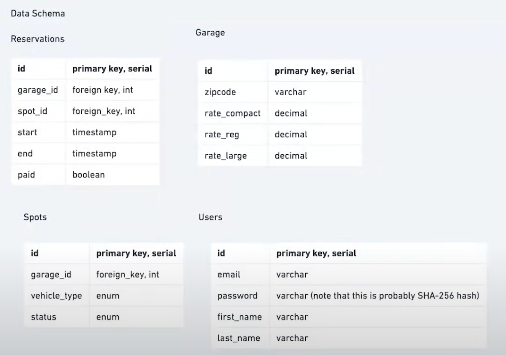
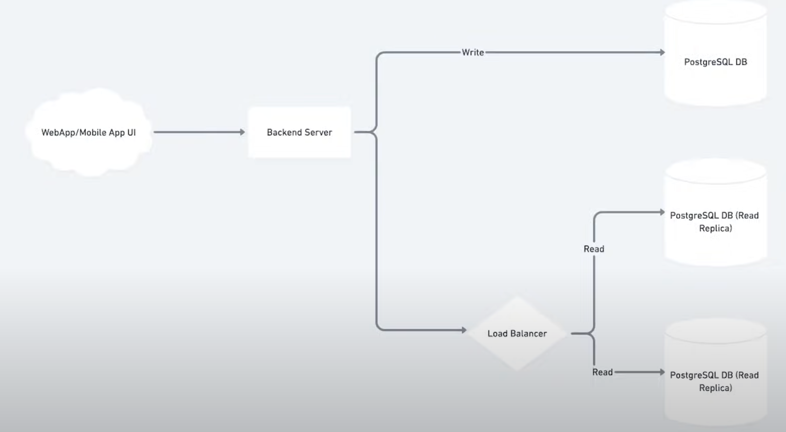

## Designing a Parking Garage ( System Design Interview )

### Objective : 
To design payments and Reservation system for a parking garage 

## Clarifying Questions  

- Do we need to reserve a parking spot and get a reciept ? 
- Payment Gateway ?
- What is Preffered in CAP ( consistency , Availablity & Partition Tolerance )
    - We would require a highly consisent application , one spot cannot be reserved by two indivisuals 
- Type of spots ? 
    - Compact , small , large 
    - Prices ( Flat Rate ) ( Proce per car )
- How will the payements be handled ? 
    - 3rd party(stripe,paypal) / in-house 
- What type of application ( mobile/web + backend )
- Use the MoSCoW approach to prioritize features . The acronym MoSCoW stands for “must-have,” “should-have,” “could-have,” and “won't-have (this time).”

## Api Design

This type of design tends to have some public end points and some internal endpoints. 

- ### Public API end points 
    - /reserve GET
        - params : garage_id ,start_time, end_time
        - returns : a tuple (spot_id , reservation_id)

    - /pay POST
        - params : reservation_id
        - can be implemented by : Paypal Api , Stripe API

    - /cancel POST
        - params : resevation_id

- ### Internal API end points 

    - /calculate Payment
        - params : reservation_id
        - returns : amount
    
    - /spots_available
        - params : garage_id,vehicle_type,time
        - Ideally cars are matched to their sized spots , but a lower rank can be promoted to a higher one if their rank is full
    
    - /alloacte_spot
        - params : garage_id,vehicle_type,time

    - /createAnAccount
        - params : email-id,password,firstname,lastname

    - /login  
        - params : email-id,password

## Scalablity 

The scale is not a large one so it does not require to be a distributed system . 

## Database 

Can choose any databse you'd like . NoSQL or SQL based on your prefrence . Choose whaeever you are comfortable with . 
This is using PostSQL/MySQL.

## High-Level Architecture 

## Trade-Off

1. Consistency will be focussed , thus the one of the CAP will have to backoff . Highly Latent application 
2.  When Someone is writing to DB , `readlock` the replicas
3. Third Party Payment is used . 